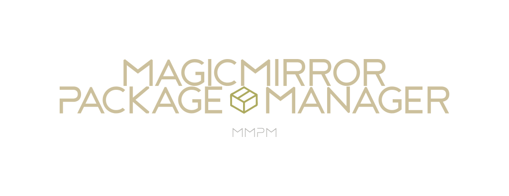

<p align="center">
  <!-- badges start -->
  <a href="https://www.paypal.com/cgi-bin/webscr?cmd=_donations&business=L2ML7F8DTMAT2&currency_code=USD&source=ur" target="_blank">
    
  </a>
  
  <a href="https://pypi.org/project/mmpm" target="_blank">
    
  </a>
  <!-- badges end -->

  <a href="https://www.paypal.com/cgi-bin/webscr?cmd=_donations&business=L2ML7F8DTMAT2&currency_code=USD&source=ur" target="_blank">
    
  </a>
</p>

| Author          | Contact                           |
| --------------- | --------------------------------- |
| Brandon Marlowe | bpmarlowe-software@protonmail.com |

`MMM-mmpm`, is the companion MagicMirror module of the MMPM CLI/GUI to enable toggling visibility of
MagicMirror modules. This module requires `mmpm` and MagicMirror to be installed. For instructions
on installing `mmpm`, see [https://github.com/Bee-Mar/mmpm](https://github.com/Bee-Mar/mmpm).

## Installation

Either use the MMPM GUI Marketplace to install this module or run the following:


```sh
mmpm install MMM-mmpm
```

## Removal

Either use the MMPM GUI Marketplace to install this module or run the following:

```sh
mmpm remove MMM-mmpm
```
